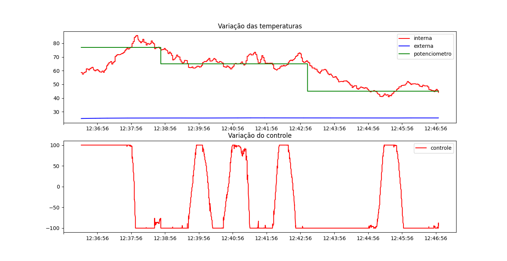

# Projeto 1 - 2020/2

Projeto 1 da disciplina de Fundamentos de Sistemas Embarcados (2020/2)

## Experimento

Para instruções de compilação veja item 5.

## 1. Objetivos

Este trabalho tem por objetivo a implementação do controle de temperatura de um sistema que possui internamente dois dispositivos para alterar sua temperatura. O primeiro é um resistor de potência de 15 Watts utilziado para aumentar temperatura e o segundo, uma ventoinha que puxa o ar externo (à temperatura ambiente) para reduzir a temperatura. 

A temperatura de referência (TR) deve poder ser definida pelo usuário do sistema de duas maneiras:
1. Através de um Potenciômetro;
2. Através de entrada de teclado no terminal.

O controle de temperatura do sistema deve ser realizado utilizando a abordagem de controle PID (Proporcional Integral Derivativo). O PID é um dos tipos mais simples de algoritmos de controle que proporciona um bom desempenho para uma grande variedade de aplicações.

Neste caso, quando o valor medido de temperatura ficar abaixo do limite inferior, o controlador deverá acionar o resistor de potência para aquecer o sistema. Caso a temperatura medida esteja acima do limite superior, o controlador deve desligar a resistência e acionar a ventoinha. 

## 2. Controle PID

O conceito fundamental de um controlador se baseia em monitorar uma ou mais variáveis de um processo (neste caso a temperatura interna) e medir a diferença entre seu valor atual (TI) a uma valor de referência (TR) desejado. A partir dessa medida de Erro = TR - TI, toma-se uma ação de correção para que o sistema alcançe exatamente o valor desejado.

Exemplificando, neste sistema, caso a temperatura esteja abaixo da desejada, a resistência deve ser ligada de modo a aquecer o mesmo até chegar à temperatura desejada. Do contrário, caso a temperatura esteja acima da desejada, a ventoinha deve ser ligada para que a temperatura seja diminuida.

A abordagem mais simples de controle descrita acima é chamada de controle On-Off ou Liga-Desliga em que a fonte de aquecimento ou de resfriamento são ligadas ou desligadas de modo completo. Esta estratégia funciona, porém sua operação impede que o sistema repouse exatamente em uma temperatura desejada, ao invés disso, o sistema oscila em torno da temperatura de referência conforme mostrado na figura abaixo.

<!-- 

 -->

Uma abordagem um pouco mais elaborada, é a da utilização do controle Proporcional, Integral e Derivativo (PID) que une três tipos de ações sobre a variável de controle para minimizar o erro do sistema até que o mesmo alcançe a referência desejada. No caso deste sistema, nossa variável de controle é o acionamento da resistência (R) e nosso erro é a diferença entre a temperatura de referência e a temperatura interna do sistema (Erro = TR - TI).

Detalhando as 3 ações do PID temos:
- Controle Proporcional (P): ajusta a variável de controle de forma proporcional ao erro, ou seja, quanto maior o erro, maior a intensidade de acionamento do resistor (0 a 100%).
- Controle Integral (PI): ajusta a variável de controle baseando-se no tempo em que o erro acontece, acumulando este erro (integral).
- Controle Derivativo (PD): ajusta a variável de controle tendo como base a taxa de variação do erro ou a velocidade com a qual o sistema está variando o erro.

<!-- A histerese é definida como a diferença entre o limite superior e o inferior da variável a ser controlada. Por exemplo, se a temperatura de operação do sistema for definida como 40˚C com histerese de 4˚C, os limites inferior e superior serão respectivamente de 38˚C e 42˚C. -->

## 3. Componentes do Sistema

O sistema como um todo é composto por:
1. Ambiente fechado controlado com o resistor de potência e ventoinha;
2. 01 Sensor LM35 para a medição da temperatura interna (TI) do ambiente fechado;
3. 01 Sensor BME280 (I2C) para a medição da temperatura externa (TE);
4. 01 módulo Display LCD 16x2 com circuito I2C integrado (Controlador HD44780);
5. 01 Conversor lógico bidirecional (3.3V / 5V);
6. Circuito de potência com 2 relés;
6. 01 Arduino Micro;
7. Potenciômetro;
8. Raspberry Pi 4;

## 4. Conexões entre os módulos do sistema

1. O sensor de temperatura BM280 está ligado ao barramento I2C e utiliza o endereço (0x76);
2. O módulo de display LCD está conectado ao barramento I2C utilizando o endereço 0x27;
3. O resistor de potência e a ventoinha estão ambos ligados às portas GPIO e são acionados através do circuito de potência com relés;  
    3.1. Resistor: GPIO 23 ou Pino 16 (Board)  
    3.2. Ventoinha: GPIO 24 ou Pino 18 (Board)  
    3.3. Atenção: o acionamento dos relés está invertido. Portanto o valor de GPIO como 1 desliga o equipamento enquanto 0 liga (Sugestão: usar a bibliteca bcm2835).  
4. O Arduino está conectado à placa Raspberry Pi via UART (Protocolo MODBUS);
5. O potenciômetro é conectado à porta analógica (A1) do Arduino;
6. O sensor de temperatura LM35 para medição do ambiente controlado está ligado à porta analógica (A0) do Arduino;

## 5. Compilando o projeto

Para realizar a compilação do projeto primeiro é preciso instalar as dependências e rodar o comando make

## 6. Referências

[PID - Wikipedia](https://pt.wikipedia.org/wiki/Controlador_proporcional_integral_derivativo)  
[Driver da Bosh para o sensor BME280](https://github.com/BoschSensortec/BME280_driver)  
[Biblioteca BCM2835 - GPIO](http://www.airspayce.com/mikem/bcm2835/)  
[Controle do LCD 16x2 em C](http://www.bristolwatch.com/rpi/i2clcd.htm)  
[Biblioteca WiringPi GPIO](http://wiringpi.com)  
[PWM via WiringPi](https://www.electronicwings.com/raspberry-pi/raspberry-pi-pwm-generation-using-python-and-c)

